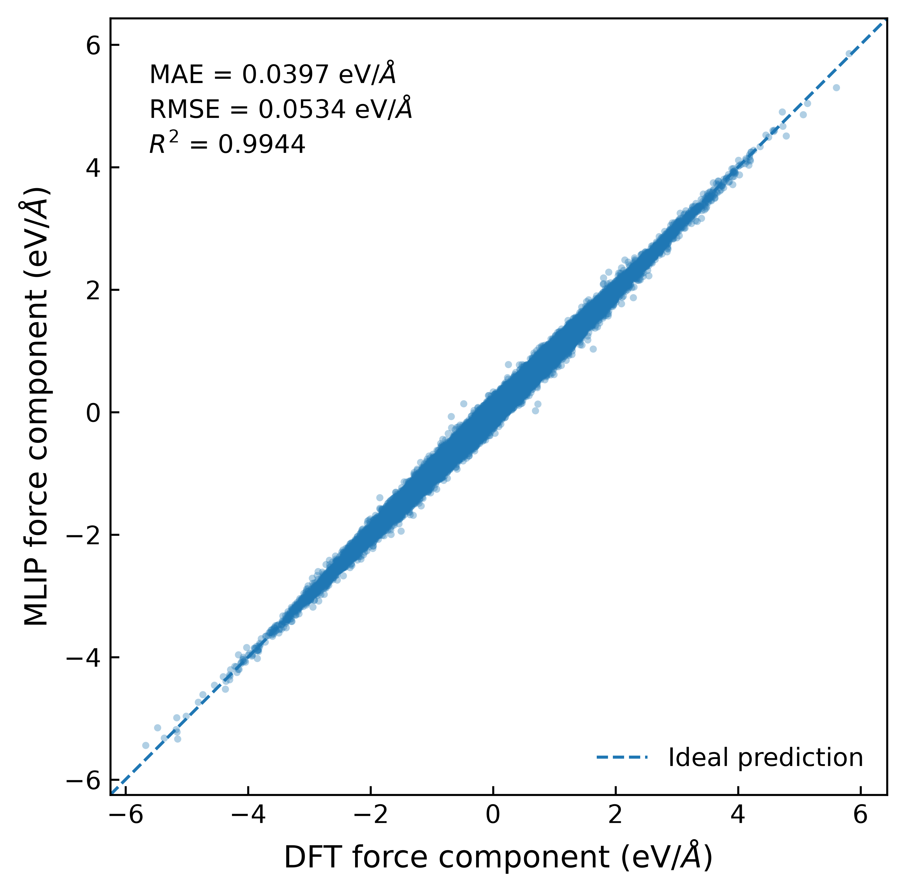
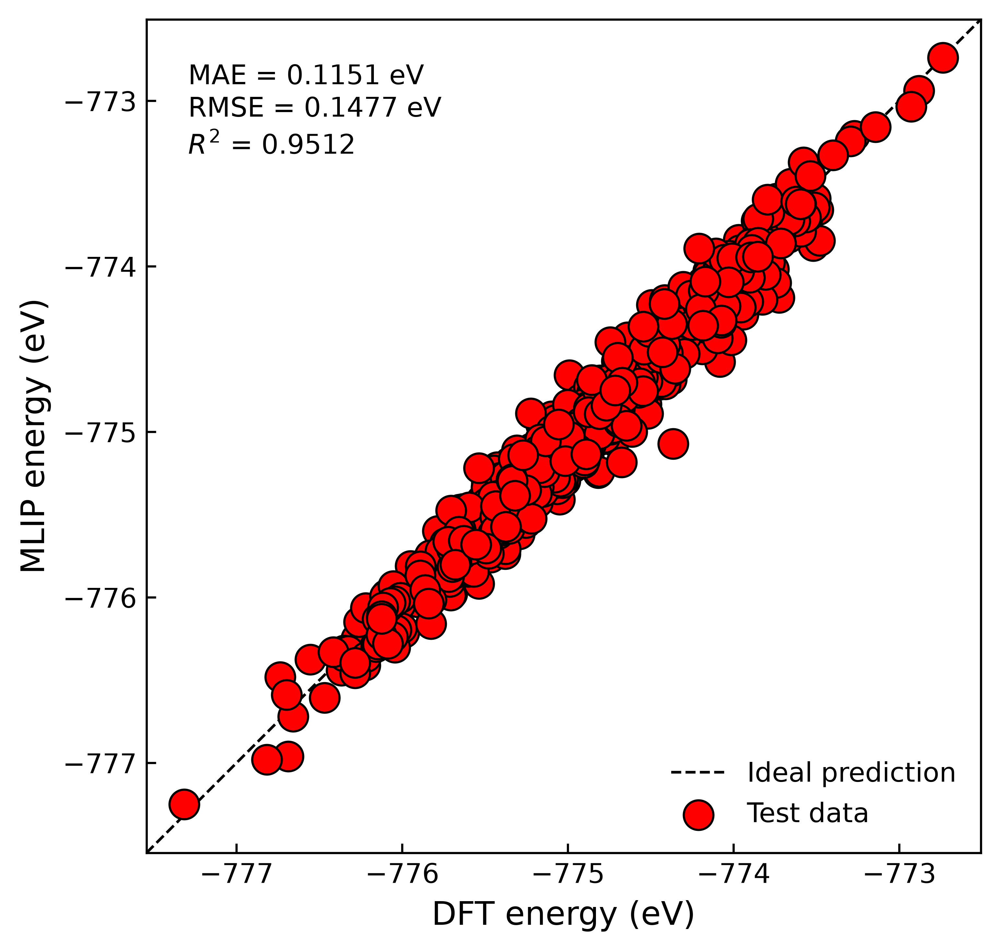

This is an example of how ab initio molecular dynamics (AIMD) results can be used to train a machine learning interatomic potential.
In this case, Pt(111) and water at the ambient temperature, 298.15 K, are considered. The AIMD results are taken from https://doi.org/10.1063/5.0077580.
The last 8000 snapshots are taken for training, test, and validating. This is because of (i) this is an example project so that shorter, better in order to save computational resources and (ii) the last 8000 snapshots definitely ensure the system is in the equilibrium state.

  
  

